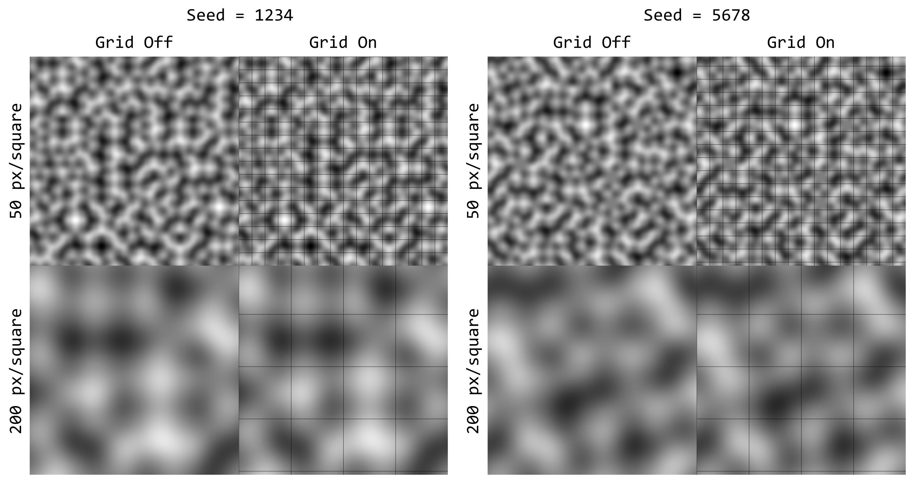

# Perlin_2D
## Purpose
This Java implementation of 2D Perlin Noise has two purposes:
1. To provide a freely available and reusable 2D implementation of Perlin Noise, since most implementations assume a 3D implementation.
2. To provide an example of Perlin Noise which others can easily understand and learn from. To this end, this code features extensive documentation and commenting, intended to be understandable even to those with minimal prior knowledge of Perlin Noise.
## Features
* Graphically Shows the output of 2D Perlin Noise
* Allows the user to select a seed for the Perlin Noise
* Allows the user to select the number of pixels per square for the Perlin Noise's grid
* Allows the user to toggle visibility of the Perlin grid
## Example

